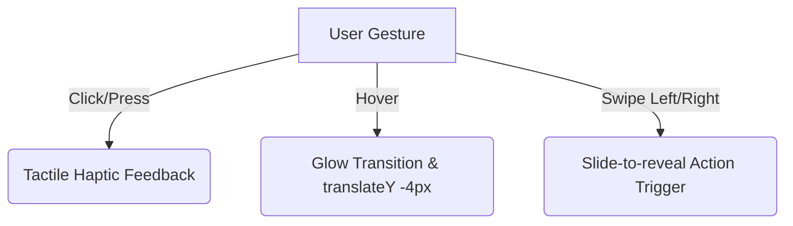

# Unity Oracle Aggregator - Branding & Style Guide

This style guide outlines the design system, typography, colors, layout components, and animation patterns required to perform a full premium visual redesign of the Unity Oracle Aggregator. It maintains all current verified backend integrations (Discord OAuth, Redis caching, PostgreSQL user settings, and FCM notification services).

---

## 🎨 Theme & Color System

The application features a **Futuristic Glassmorphic Dark Theme** with a high-contrast palette of black, charcoal, electric orange, neon red, and gold accents. 

### 1. Brand Color Swatches
*   **Deep Obsidian (Primary Background):** `#060608`
    *   *Usage:* Solid viewport backgrounds, page base.
*   **Electric Orange (Accent & CTA):** `#ff6b35` (HSL: `16°, 100%, 60%`)
    *   *Usage:* Interactive links, buttons, hover borders, primary metrics, scrollbar thumbs.
*   **Neon Cyber Red (Bearish & Alerts):** `#dc3545`
    *   *Usage:* Bearish trends, negative P&L, system alert cards, volume outflows.
*   **Cyber Gold / Yellow (Bullish & Highlights):** `#ffc107`
    *   *Usage:* Positive P&L, premium badges, star watchlist indicators, volume inflows.

### 2. Layout Gradients
*   **Glass Panel Fill:** `linear-gradient(145deg, rgba(30, 30, 35, 0.4) 0%, rgba(15, 15, 20, 0.6) 100%)`
    *   *Properties:* `backdrop-filter: blur(16px); border: 1px solid rgba(255, 255, 255, 0.08);`
*   **Primary Button HSL Gradient:** `linear-gradient(135deg, #ff6b35 0%, #dc3545 100%)`
*   **Highlight Button HSL Gradient:** `linear-gradient(135deg, #ffc107 0%, #ff6b35 100%)`
*   **Page Background Gradient:** `linear-gradient(135deg, #060608 0%, #121216 100%)`

---

## ✍️ Typography & Hierarchy

Clean, sans-serif futuristic fonts ensure readability on screens and mobile viewports.

*   **Primary Font Family:** `'Outfit'`, `'Inter'`, or system `'Segoe UI'`
*   **Hero / Headings Font Family:** `'Cabinet Grotesk'`, `'Outfit'`, or `'Segoe UI'`
*   **Weight Scale:**
    *   `300 (Light)` - Used for secondary text, metadata, labels.
    *   `500 (Medium)` - Body text, select options, form values.
    *   `700 (Bold)` - Titles, CTA buttons, metrics numbers, high-impact alerts.
*   **Type Scale:**
    *   `h1 (Display Header):` `2.5rem` (`36px` / `40px` line-height) - Glow-accented titles.
    *   `h3 (Section Header):` `1.75rem` (`28px`)
    *   `h5 (Card Title):` `1.25rem` (`20px`)
    *   `Body (Regular):` `1rem` (`16px`)
    *   `Small / Muted:` `0.875rem` (`14px`)

---

## 🎛️ Design Tokens & Spacing

*   **Border Radius:**
    *   Cards & Large Modals: `16px` (`1rem`)
    *   Buttons, Badges & Inputs: `24px` / `50%` rounded pill shapes
*   **Interactive Focus Rings:**
    *   Outline: `2px solid #ff6b35` with `outline-offset: 4px` for accessibility.
*   **Touch Targets (Mobile coarse inputs):**
    *   All buttons, input forms, toggles, and nav links must have a minimum dimension of `44px x 44px`.

---

## ⚡ Micro-Animations & Gestures

Providing physical feedback for user interaction increases engagement.

1.  **Haptic Feedback:** Native mobile wrapper triggers vibration events on tap (`lightImpact()` from [haptics.ts](file:///c:/Users/z_shi/Desktop/N8NPROJECTS/unity-oracle-aggregator/lib/haptics.ts)).
2.  **Edge Swipe Navigation:** Dragging from the left edge of the screen pulls out the mobile navigation tray using `@use-gesture/react` triggers.
3.  **Metrics Pulsing:** Glow rings pulsate on active data triggers (e.g., `.pulse-orange` for live notifications, `.pulse-green` for market updates).
4.  **Button Shine:** A smooth white gradient swipe executes horizontally across active buttons on hover states.

---

## 🧩 Key Redesign Constraints (Functionality to Preserve)

When building new layout markup, you **MUST** ensure the following backend bindings are maintained intact:

| Component / Page | Required Elements to Bind | Backend File Reference |
| :--- | :--- | :--- |
| **Navbar & Header** | Bell notification trigger button, unread counts (`unreadNotificationCount`), dynamic profile links. | [Navigation.tsx](file:///c:/Users/z_shi/Desktop/N8NPROJECTS/unity-oracle-aggregator/components/Navigation.tsx) |
| **Home Screen** | Data source toggle button matching cookie/state. | [page.tsx](file:///c:/Users/z_shi/Desktop/N8NPROJECTS/unity-oracle-aggregator/app/page.tsx) |
| **Profile Screen** | Discord server membership card (binds to `user.isServerMember`), followed analysts state, portfolio holdings mapping. | [page.tsx](file:///c:/Users/z_shi/Desktop/N8NPROJECTS/unity-oracle-aggregator/app/profile/page.tsx) |
| **Settings Directory** | Context-bound toggles for notifications, currency selection dropdown, profile file uploads. | [page.tsx](file:///c:/Users/z_shi/Desktop/N8NPROJECTS/unity-oracle-aggregator/app/settings/page.tsx) |
| **Watchlist Tool** | Input submission mapping to `addToWatchlist()` and deletions mapped to `removeFromWatchlist()`. | [page.tsx](file:///c:/Users/z_shi/Desktop/N8NPROJECTS/unity-oracle-aggregator/app/tools/watchlist/page.tsx) |
| **Positions Tracker** | Leverage math triggers (spot vs perp margin, margin values, entry price, unrealized PnL calculator). | [PositionTracker.tsx](file:///c:/Users/z_shi/Desktop/N8NPROJECTS/unity-oracle-aggregator/components/PositionTracker.tsx) |

---

## 📐 Responsive Screen Layout Grid

*   **Mobile (< 768px):** Single column scrolling, edge-swipe active menu, bottom sheet modal popups for inputs.
*   **Tablet (768px - 1024px):** 2-column grid systems for cards, metrics summary columns.
*   **Desktop (> 1024px):** 3-column layouts, persistent side drawers, high-resolution full-width tables.
